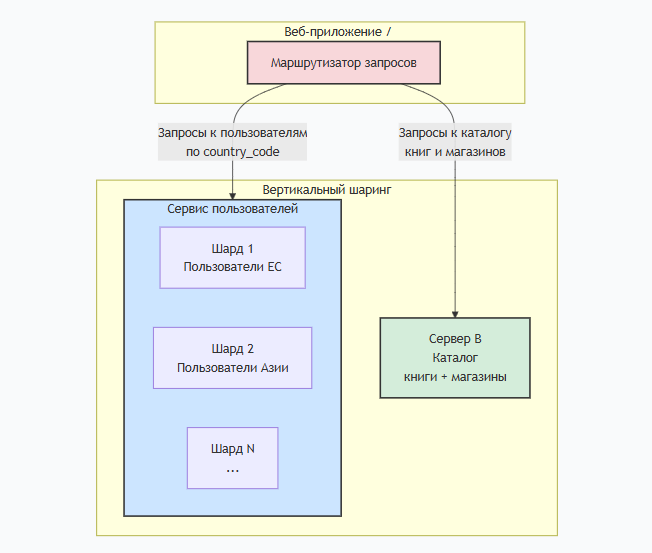

# Домашнее задание к занятию "`Репликация и масштабирование. Часть 2`" - `Белолипецкий Леонид`

---

### Задание 1

**1. Активный Master-сервер и пассивный репликационный Slave-сервер:**  
<ins>Повышение отказоустойчивости:</ins> Если мастер-сервер выходит из строя, можно вручную переключиться на slave-сервер.  <ins>Улучшение производительности чтения:</ins> Всю нагрузку от аналитических запросов, отчетов и сложных выборок можно перенести на slave-сервер, разгрузив тем самым мастер для критически важных операций записи.  <ins>Географическое распределение:</ins> Slave-сервер можно разместить в другом регионе для уменьшения задержки для локальных пользователей.

**2. Master-сервер и несколько Slave-серверов:**  
<ins>Массовое масштабирование чтения:</ins> Это главное преимущество. Нагрузку на чтение можно распределить между множеством slave-серверов с помощью балансировщика нагрузки.  
<ins>Высокая доступность и отказоустойчивость:</ins> При выходе из строя одного slave-сервера, другие продолжают работать. Система может выдержать несколько отказов в части чтения.  
<ins>Гибкость развертывания:</ins> Позволяет использовать менее мощное железо для slave-серверов, так как нагрузка распределена.

---

### Задание 2

**Принципы построения системы:**  
<ins>Вертикальный шаринг:</ins> Разделение таблиц по разным серверам на основе их функциональной принадлежности. Таблицы имеют разную нагрузку и предметную область.  
<ins>Горизонтальный шаринг:</ins> Разделение одной таблицы на множество частей (шардов) по определенному ключу, которые располагаются на разных серверах. Когда объем данных или нагрузка на одну таблицу становятся слишком велики.  
<ins>Разграничение:</ins> Сначала применяем вертикальный шаринг, чтобы изолировать разные сущности. Затем, для таблиц, которые этого требуют, применяем горизонтальный шаринг.

---

